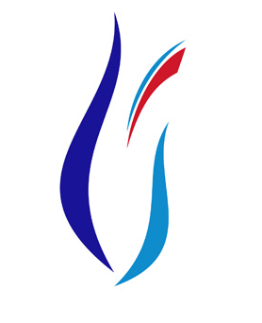

<table>
<colgroup>
<col style="width: 16%" />
<col style="width: 83%" />
</colgroup>
<tbody>
<tr class="odd">
<td></td>
<td>
<strong>MANİSA CELAL BAYAR ÜNİVERSİTESİ</strong>

<strong>Hasan Ferdi Turgutlu Teknoloji Fakültesi</strong>

<strong>Yazılım Mühendisliği Bölümü</strong>
</td>
</tr>
</tbody>
</table>

**PROFESYONEL YAZILIM GELİŞTİRME / PROJE TANIMI**

<table>
<colgroup>
<col style="width: 25%" />
<col style="width: 74%" />
</colgroup>
<tbody>
<tr class="odd">
<td colspan="2"><strong>PROJE BİLGİLERİ</strong></td>
</tr>
<tr class="even">
<td><strong>Ekip Üye(leri)</strong></td>
<td>Salih ÖZKARA – Zeynep ARSLAN</td>
</tr>
<tr class="odd">
<td><strong>Proje Başlığı</strong></td>
<td>Blokchain Tabanlı Sosyal Medya Uygulaması</td>
</tr>
<tr class="even">
<td><strong>Proje Amacı</strong></td>
<td>Bu proje blokchain tabanlı bir sosyal medya uygulaması
geliştirilmesini içerir. Geliştirilecek sistem anonim bir şekilde
mesajlaşma ve gönderi oluşturmayı amaçlıyor blokchain sistemi ile
verilerin doğruluğunu ve değiştirilmezliğini sağlamayı amaçlıyor.</td>
</tr>
<tr class="odd">
<td><strong>Projenin Hedefleri</strong></td>
<td>Geliştirilecek sosyal medya uygulamasında, private ve public key ile
tamamen anonim bir yapı kurulcaktır. Kullanıcıların kayıt esnasında
kullanıcının ulusal kimlik numarası alınarak hashlenerek veritabanında
tutulacaktır bu sayede sahte hesaplardan kurtulmak amaçlanacaktır bir
kimlik numarası ile sadece bir hesap açılabilecektir. Kimlik numarası ve
seçilmiş rastgele 20 kelimeden kullanıcıya private key oluşturulacaktır.
Sistemde bir admin bulunmayacak herkes anonim olarak fikrini ifade
edebilecek. Proje ile ilgili ayrıntılı bir gereksinim dokümanı
yapılacaktır. Bu web tabanlı yazılım projesi analiz, tasarım ve
gerçekleştirme safhalarını içerecektir. Her safhanın sonunda
dokümantasyon hazırlancaktır. Analiz dokümanında her bir use-case’in
kısa tanımı, normal ve istisnai senaryoları yazılacaktır. Ayrıca her bir
use-case senaryosu için UML diyagramları çizilecektir. Üst seviye
tasarımı gerçekleştirmek amacıyla genel sistem mimarisi çizilecektir.
Gerçekleştirme safhasında da danışman tarafından belirlenen modüller
için birim testi yapılacaktır.</td>
</tr>
<tr class="even">
<td><strong>Hedeflenen Pazar</strong></td>
<td><ul>
<li>
Uluslararası
</li>
</ul></td>
</tr>
<tr class="odd">
<td><strong>Hedef Kitle</strong></td>
<td><ul>
<li>
Sosyal medya kullanan insanlar.
</li>
</ul></td>
</tr>
<tr class="even">
<td><strong>Geliştirme Ortamı</strong></td>
<td><ul>
<li>
Web ile başlangıç ilerleyen zamanlarda mobil uygulama.
</li>
</ul></td>
</tr>
<tr class="odd">
<td colspan="2"><strong>SWOT Analizi</strong></td>
</tr>
<tr class="even">
<td><strong>S</strong></td>
<td>Günümüzdeki sosyal medya hesapları sahte hesaplarla doldu ve çoğu
kişi fikrini ifade ettikten sonra siliyor ve öyle bir fikirde
bulunmadığını iddia ediyor. Doğruların gün yüzüne çıkması
hedefleniyor.</td>
</tr>
<tr class="odd">
<td><strong>W</strong></td>
<td>Ekip olarak tek bir kişinin üstesinden kalkması zor bir proje. Güçlü
ve sağlam bir ekip gerekiyor. Blockchain teknolojisine çok hâkim
değilim. Ürünü demo olarak geliştirmek güzel olabilir.</td>
</tr>
<tr class="even">
<td><strong>O</strong></td>
<td>Blockchain teknolojisi ile güvenli bir şekilde ürünümü
geliştirebilirim. Blokchain community’ sinden yardım alabilirim,
blockchain token ile sermaye toplayabilirim.</td>
</tr>
<tr class="odd">
<td><strong>T</strong></td>
<td>Blockchain kullanılacağı için gönderilerde gecikme yaşanabilir.
Tamamen anonim olacağı için +18 içerik barındırabilir. Ve bunu yapan
kişinin kimliği tespit edilemez.</td>
</tr>
<tr class="even">
<td><strong>Geliştirme Ortamı/Araçları</strong></td>
<td>.Net Core 6 , Angular 13 , Sql server</td>
</tr>
<tr class="odd">
<td><strong>Anahtar Kelimeler</strong></td>
<td>Web, Blokchain, Sosyal Medya</td>
</tr>
<tr class="even">
<td><strong>Olası Ürün Çıktısı</strong></td>
<td>
Web projesi (.exe)

Mobil uygulama (.apk)
</td>
