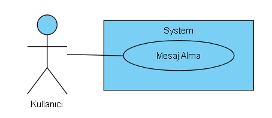

**T.C.**

**MANİSA CELAL BAYAR ÜNİVERSİTESİ**

**HASAN FERDİ TURGUTLU TEKNOLOJİ FAKÜLTESİ**

**YAZILIM MÜHENDİSLİĞİ BÖLÜMÜ**

**PROFESYONEL YAZILIM GELİŞTİRME**

**(LİSANS BİTİRME TEZİ)**

**TEZ ADI**

**wiyu**

**Yazar Adı**

**Zeynep Arslan – Salih Özkara**

**Danışman**

**Emin Borandağ**

**MANİSA–2022**

TEZ ONAYI

**Zeynep Arslan ve Salih Özkara** tarafından hazırlanan **"wiyu"** adlı
tez çalışması xx/xx/xxxx tarihinde aşağıdaki jüri üyeleri önünde Manisa
Celal Bayar Üniversitesi Hasan Ferdi Turgutlu Teknoloji Fakültesi
Yazılım Mühendisliği Bölümünde **Lisans Tezi** olarak savunulmuş ve
**oyçokluğu / oybirliği** ile başarılı olarak kabul edilmiştir.

**Danışman** ..............................

Manisa Celal Bayar Üniversitesi

**Jüri Üyesi** ..............................

Manisa Celal Bayar Üniversitesi

**Jüri Üyesi** ..............................

Manisa Celal Bayar Üniversitesi

TAAHHÜTNAME

Bu tezin Manisa Celal Bayar Üniversitesi Hasan Ferdi Turgutlu Teknoloji
Fakültesi Yazılım Mühendisliği Bölümü’nde, akademik ve etik kurallara
uygun olarak yazıldığını ve kullanılan tüm literatür bilgilerinin
referans gösterilerek tezde yer aldığını beyan ederim.

**AD SOYAD**

Zeynep Arslan- Salih Özkara

İçindekiler

[TEZ ONAYI](#_Toc105957704)

[TAAHHÜTNAME](#_Toc105957705)

[ŞEKİLLER DİZİNİ](#_Toc105957707)

[TABLO DİZİNİ](#_Toc105957708)

[TEŞEKKÜR](#_Toc105957709)

[ÖZET](#_Toc105957710)

[ABSTRACT](#_Toc105957711)

[1 GİRİŞ](#giriş)

[1.1 Projenin Amacı](#projenin-amacı)

[1.2 Projenin Özgünlüğü](#projenin-özgünlüğü)

[2 GENEL BİLGİLER](#genel-bilgiler)

[2.1 Hedef](#hedef)

[2.2 Hedef Kitle](#hedef-kitle)

[2.3 Literatür Araştırması](#literatür-araştırması)

[2.3.1 Steemit](#steemit)

[2.3.2 Peepeth](#peepeth)

[2.3.3 Society2](#society2)

[2.4 Gereksinimler](#gereksinimler)

[2.4.1 İşlevsel Gereksinimler](#işlevsel-gereksinimler)

[2.4.2 İşlevsel Olmayan Gereksinimler](#işlevsel-olmayan-gereksinimler)

[3 DENEYSEL KISIM (MATERYAL VE YÖNTEMLER)](#deneysel-kisim-materyal-ve-yöntemler)

[3.1 Materyal](#_Toc106043411)

[3.2 Yöntem](#_Toc106043412)

[3.3 Tasarımlar](#tasarımlar)

[3.3.1 Kaydolma](#kaydolma)

[3.3.2 Giriş](#giriş-1)

[3.3.3 Profil](#profil)

[3.3.3.1 Bilgilerimi Güncelle](#bilgilerimi-güncelle)

[3.3.3.2 Takip Etme](#takip-etme)

[3.3.3.3 Takipten Çıkarma](#takipten-çıkarma)

[3.3.4 Ana Sayfa](#ana-sayfa)

[3.3.4.1 Gönderi Paylaşma](#gönderi-paylaşma)

[3.3.4.2 Gönderi Beğenme](#gönderi-beğenme)

[3.3.4.3 Yorum Yapma](#yorum-yapma)

[3.3.5 Arama](#arama)

[3.3.5.1 Kullanıcı Arama](#kullanıcı-arama)

[3.3.5.2 Gönderi Arama](#gönderi-arama)

[3.3.6 Bildirimler](#bildirimler)

[3.3.7 Mesaj](#mesaj)

[3.3.7.1 Mesaj Alma](#mesaj-alma)

[3.3.7.2 Mesaj Atma](#mesaj-atma)

[3.3.8 Ayarlar](#ayarlar)

[3.3.8.1 Tema değiştirme](#tema-değiştirme)

[3.3.8.2 Çıkış Yapma](#çıkış-yapma)

ŞEKİLLER DİZİNİ

[Şekil 2.3.1.1 Steemit Uygulaması Ana Ekranı](#_Ref105968042)

[Şekil 2.3.2.1 Peepeth Uygulaması Ana Ekranı](#_Ref105967970)

[Şekil 2.3.3.1 Society2 Uygulaması Ana Ekranı](#_Toc106325287)

[Şekil 3.1.1.1 Sisteme Kayıt Olma Use-Case’i](#_Toc106325288)

[Şekil 3.1.2.1 Sisteme giriş yapma USE-CASE’i](#_Toc106325289)

[Şekil 3.1.3.1 Profil Bilgileri Güncelleme USE-CASE’i](#_Toc106325290)

[Şekil 3.1.3.2 Profili Takip Etme USE-CASE’i](#_Toc106325291)

[Şekil 3.1.3.3 Profili Takipten Çıkarma USE-CASE’i1](#_Toc106325292)

[Şekil 3.1.4.1 Ana Sayfada Gönderi Paylaşma USE-CASE’i](#_Toc106325293)

[Şekil 3.1.4.2 Ana Sayfada Gönderi Beğenme USE-CASE’i](#_Toc106325294)

[Şekil 3.1.4.3 Profile Yorum Yapma USE-CASE’i](#_Toc106325295)

[Şekil 3.1.5.1 Kullanıcı Arama USE-CASE’i](#_Toc106325296)

[Şekil 3.1.5.2 Gönderi Arama USE-CASE’i](#_Toc106325297)

[Şekil 3.1.6.1 Bildirimler USE-CASE’i](#_Toc106325298)

[Şekil 3.1.7.1 Mesaj Alma USE-CASE’i](#_Toc106325299)

[Şekil 3.1.7.2 Mesaj Atma USE-CASE’i](#_Toc106325300)

[Şekil 3.1.8.1 Ayarlar Tema Değiştirme USE-CASE’i](#_Toc106325301)

[Şekil 3.1.8.2 Ayarlar Çıkış Yapma USE-CASE’i](#_Toc106325302)

TABLO DİZİNİ

[Tablo 3.1.1 Kayıt USE-CASE](#_Toc106325261)

[Tablo 3.1.2 Giriş USE-CASE](#_Toc106325262)

[Tablo 3.1.3 Profil Bilgileri Güncelleme USE-CASE](#_Toc106325263)

[Tablo 3.1.4 Profil Takip Etme USE-CASE](#_Toc106325264)

[Tablo 3.1.5 Profil Takipten Çıkarma USE-CASE](#_Toc106325265)

[Tablo 3.1.6 Ana Sayfa Gönderi Paylaşma USE-CASE](#_Hlk106041928)

[Tablo 3.1.7 Anasayfa Gönderi Beğenme USE-CASE](#_Toc106325267)

[Tablo 3.1.8 Profil Yorum Yapma USE-CASE](#_Toc106325268)

[Tablo 3.1.9 Arama Kullanıcı Arama USE-CASE](#_Toc106325269)

[Tablo 3.1.10 Arama Gönderi Arama USE-CASE](#_Toc106325270)

[Tablo 3.1.11 Bildirimler USE-CASE](#_Toc106325271)

[Tablo 3.1.12 Mesaj Alma USE-CASE](#_Toc106325272)

[Tablo 3.1.13 Mesaj Atma USE-CASE](#_Toc106325273)

[Tablo 3.1.14 Ayarlar Tema Değiştirme USE-CASE](#_Toc106325274)

[Tablo 3.1.16 Ayarlar Çıkış Yapma USE-CASE](#_Toc106325275)

TEŞEKKÜR

Tez çalışmamız sırasında kıymetli bilgi, birikim ve tecrübeleri ile bize
yol gösterici ve destek olan değerli danışman hocamız Yrd. Doç. Dr. Emin
BORANDAĞ ‘a sonsuz teşekkür ve saygılarımızı sunarız.

Son olarak eğitim hayatımız boyunca sevgisini, güvenini ve desteğini
esirgemeyen bu hayattaki en büyük şansımız olan ailemize sonsuz
teşekkürler.

Zeynep Arslan- Salih Özkara

Manisa, 2022

ÖZET

**Lisans Tezi**

**Manisa Celal Bayar Üniversitesi**

**Hasan Ferdi Turgutlu Teknoloji Fakültesi**

**Yazılım Mühendisliği Bölümü**

**Danışman:** Yrd. Doç. Dr. Emin BORANDAĞ

Günümüz dünyasında insanlar, iletişim aracı olarak sosyal paylaşım
platformlarında yer alan uygulamaları tercih etmektedirler. Dağınık
halde bulunan ve çoğunlukla insanlar için geliştirilmiş olan bu çeşitli
uygulamalar üzerinden kullanıcılar özgürce istediklerini paylaşarak
bilgi ve fikir paylaşımı yapmaktadırlar. Gerçekleştirilecek olan wiyu
projesi ile tüm bu problemleri tek bir çatı altında toplayarak sadece
özgürlüğe odaklanmış ortama özgü bir uygulama yapılmıştır.

Wiyu paylaşım platformunu kullanan kullanıcılar sahip olduğu özgürlükle
beraber istediği profilleri oluşturabilmektedir. Oluşturulan profil
sayfalarında görüntü, yazı paylaşımları yapabilmekte ve aynı zamanda
kaydı olan diğer insanları takip ederek veya mesaj atarak etkileşimde
bulunabilmektedirler.

**Anahtar Kelimeler:** **İfade Özgürlüğü, Sosyal Paylaşım Platformu,
Kullanılıcılar, Özgürce Paylaşımlar, Profil Sayfaları**

**2022, xxx sayfa**

ABSTRACT

**M.Sc. / PhD Thesis**

**Zeynep Arslan- Salih Özkara**

**Celal Bayar University**

**Hasan Ferdi Turgutlu Faculty of Technology**

**Department of Software Engineering**

**Supervisor:** Assist. Assoc. Dr. Emin Borandag

In today's world, people prefer applications on social networking
platforms as a means of communication. Through these various
applications, which are scattered and mostly developed for people, users
freely share information and ideas by sharing what they want. With the
wiyu project to be realized, an application specific to the environment
focused only on freedom has been made by gathering all these problems
under a single roof.

Users using the Wiyu sharing platform can create the profiles they want
with the freedom they have. They can share images and texts on the
created profile pages, and also interact with other registered people by
following them or sending a message.

**Keywords:** **Freedom of Expression, Social Networking Platform,
Users, Freely Posts, Profile Pages**

**2022, XXX pages**

# **GİRİŞ**

> Herkes, düşünce ve kanaatlerini söz, resim, yazı veya başka yollarla
> tek başına veya toplu olarak açıklama ve yayma hakkına sahiptir. Bu
> hürriyet resmî makamların müdahalesi olmaksızın fikirlerini ifade etme
> serbestliğini de kapsar \[1\]. Her türlü dış etkiden bağımsız olarak
> kendi istencine, kendi düşüncesine göre karar vermesi her insanın
> isteğidir. Fakat bunun yanında bazı insanlar bazı düşüncelerini,
> insanlar tarafından tepki çekeceğini düşündüğü için özgür bir şekilde
> ifade edememektedir. İnsanlar tamamen özgür olabileceği, kimsenin
> onları bilemeyeceği bir ortam istemektedirler.
>
> Günümüzde böyle bir sosyal medya uygulaması şu an bulunmamaktadır.
> Uygulamalarda hesap sahiplerinin kim olduğu bilinmektedir. Fakat bizim
> yapacağımız sosyal medya uygulamasında hesap sahiplerinin kim olduğu
> bilinmemektedir. Bu yüzden insanları özgürce istediklerini
> söyleyebilmektedir. Fakat bilinmelidir ki bu paylaşılan fikir
> silinemez veya değiştirilemez. Değiştirmek veya silmek yerine üzerine
> başka fikirler paylaşabilirler.
>
> Biz bu uygulamayı yaparken Blockchain kullanacağız. Blockchain’in en
> büyük avantajlarından biri, blok zincirlerinin sağladığı güvenlik
> seviyesidir. Aynı zamanda blok zincirlerinin çevrimiçi işlemlerde
> hassas verileri koruyacağı anlamına gelir. Bizim blockchain
> kullanmamızın sebebi güvenliğin her şeyden çok önemli olması ve
> herkesin tamamen anonim olabilmesidir. Veriler Blockchain’de tutulduğu
> için insanların yazdıkları da güvenli bir şekilde korunacaktır. \[2\]
>
> Gizlilik ve güvenlik blockchain’in avantajları arasındayken,
> dezavantajları arasında bu kaydedilen bilgileri değiştirememek ve
> silememek yer almaktadır. Fakat bu dezavantaj olarak görülen şey bizim
> uygulamamızda istenilen bir durum olduğundan bizim için avantajlı bir
> duruma dönüşmektedir. Dezavantaj sadece kullanıcının ona verilen
> private key’i kaybettiğinde olmaktadır. Eğer kaybederse o hesaba
> tekrar girmesi çok zorlaşmaktadır. \[2\]
>
> Çalışmamızın ikinci bölümünde projenin hedefi, hedef kitlesi ve
> literatür araştırmamız yer almaktadır. Aynı zamanda işlevsel olan ve
> olmayan gereksinim kısmımız da bulunmaktadır. Üçüncü bölümde ise
> USE-CASE diyagramları ve tablolar bulunmaktadır.

## Projenin Amacı

> Geliştirilen platform insanların evliliklerini kurum ve kuruluşlardan
> bağımsız olarak kolay bir şekilde gerçekleştirmelerini ve toplumun
> yapısını korumayı amaçlamaktadır.

## Projenin Özgünlüğü

> İnsanlar internetin hayatımıza girmesi ile yeni bir iletişim aracı
> keşfetmişlerdir ve buna sosyal medya diyoruz. İnsanlar birbirleri ile
> tanışıp arkadaş olabiliyor hatta evlilikler gerçekleşebiliyor.
> MarryEasy uygulaması ise bu süreçlerden bağımsız olarak evlenmek
> isteyen iki kişiye evlendiklerine dair bir kanıt sunuyor.

# GENEL BİLGİLER

## Hedef

Geliştirilecek web tabanlı bu sosyal ağ platformunda giriş işlemi
sağlanması durumunda kullanıcılar düşünce paylaşma işlemini özgürce
gerçekleştirebileceklerdir. Ayrıca kullanıcılar takip edebilme, paylaşım
yapabilme gibi işlemleri de yapabileceklerdir.

## Hedef Kitle

- İnsanlar

- Özgürce fikir paylaşmak isteyen insanlar

## Literatür Araştırması

### Steemit

> **Steemit**, içerik yayınlamak ve küratörlüğünü yapmak için
> kullanıcılarını kripto para birimi STEEM ile ödüllendiren blockchain
> tabanlı bir blog ve sosyal medya web sitesidir \[3\]. Şekil 2.3.1.1
> Steemit uygulaması ana ekranı bulunmakatadır.

Şekil . Steemit
Uygulaması Ana Ekranı

### Peepeth

Peepeth, Ethereum blok zinciri tarafından desteklenen Twitter'a
alternatif, blok zincirle çalışan bir sosyal ağdır. Hiçbir merkez
tarafından verileriniz kontrol edilmez \[4\]. Şekil 2.3.1.1 Steemit
uygulaması ana ekranı ekranı bulunmaktadır.

Şekil . Peepeth
Uygulaması Ana Ekranı

### Society2

SOCIETY2, verilerinizin ve iletişiminizin kontrolünü size geri veren,
blokchain tabanlı bir sosyal medya çerçevesidir \[5\]. Şekil 2.3.2.1
Society2 uygulaması ana ekranı bulunmaktadır.

Şekil . Society2
Uygulaması Ana Ekranı

## Gereksinimler

### İşlevsel Gereksinimler

- Kullanıcı sisteme kimlik numarası kaydolabilecektir.

- Kullanıcı sisteme sadece ona verilen private key ile giriş
  yapabilecektir.

- Kullanıcı private key’ini yanlış girdiği veya girmediği takdirde
  sisteme giriş olmayacaktır.

- Kullanıcı kendi üyeliği üzerinde kullanıcı adını ve fotoğrafını
  değiştirebilir veya güncelleyebilir.

- Kullanıcı kendi paylaştığı yazıları silemez veya değiştiremez.
  Değiştirdiği fikri varsa yeni fikrini tekrardan paylaşabilir.

- Kullanıcı başka kullanıcıların yaptığı paylaşımlara yorum yapıp o
  paylaşımları beğenebilmektedir.

- Kullanıcı başkalarıyla mesajlaşabilir, onlara dosya gönderebilir,
  onlardan dosya alabilir.

- Kullanıcı başka kullanıcıları takip edebilir, onları takipten geri
  çıkabilir.

- Kullanıcı, arama kısmından başka kullanıcıları veya gönderileri
  aratabilecektir.

- Kullanıcı gelen bildirimleri görebilecektir.

- Kullanıcı temayı değiştirebilecektir.

- Kullanıcı çıkış yapabilecektir.

### İşlevsel Olmayan Gereksinimler

- Sistem tüm web tarayıcılarında çalışabilecektir.

- Sistemi aynı anda 1000 kişi kullanabilecektir.

- Sistem ASP.NET 6 ve Angular 13 tabanlı olacaktır.

- Sistem 7/24 çalışabilecektir.

- Sisteme ileride ek özellikler eklenebilecektir.

# DENEYSEL KISIM (MATERYAL VE YÖNTEMLER)

## Tasarımlar

Bu bölümde uygulamanın USE-CASE tanımları gösterilmiştir.

### Kaydolma

> Şekil 3.1.1.1’de sisteme kaydolma USE-CASE çizilmiştir.

Şekil . Sisteme Kayıt
Olma Use-Case’i

Tablo 3.1.1’de sisteme kaydolma adımları sırasıyla yazılmıştır.

Tablo . Kayıt USE-CASE

<table>
<colgroup>
<col style="width: 100%" />
</colgroup>
<thead>
<tr class="header">
<th>
Kısa Tanım:

Sisteme Kayıt Olma use-case'i kullanıcı aktörünün ad, soyad,
kullanıcı ad, Doğum Yılı, Ulusal Kimlik Numarasını girerek sisteme
kaydolma işlemi ile gerçekleşir.
</th>
</tr>
</thead>
<tbody>
<tr class="odd">
<td>
Adım Adım Tanım:

<ol type="1">
<li>
Web sitesi açılır.
</li>
<li>
Kayıt butonuna basılır.
</li>
<li>
Kayıt için kullanıcı aktörünün ad, soyad, kullanıcı ad, Doğum
Yılı, Ulusal Kimlik Numarasını girerek kayıt gerçekleştirilir.
</li>
<li>
Kullanıcıya private key bilgileri verilir ve daha sonra bu
verilen key’in unutulma durumuna karşı koyabilmek için 20 adet kelime
verilir.
</li>
</ol></td>
</tr>
</tbody>
</table>

### Giriş

> Şekil 3.1.2.1’de sisteme giriş yapma USE-CASE çizilmiştir.

Şekil . Sisteme giriş
yapma USE-CASE’i

Tablo 3.1.2’de sisteme giriş yapma adımları sırasıyla yazılmıştır.

Tablo . Giriş USE-CASE

<table>
<colgroup>
<col style="width: 100%" />
</colgroup>
<thead>
<tr class="header">
<th>
Kısa Tanım:

Sisteme Giriş use-case’i kullanıcı aktörünün private key bilgisini
girmesi ile gerçekleştirilir.
</th>
</tr>
</thead>
<tbody>
<tr class="odd">
<td>
Adım Adım Tanım:

<ol type="1">
<li>
Web sitesi açılır.
</li>
<li>
Giriş işlemi için kullanıcı aktörü zorunlu alan olan private key
bilgisi doldurulur.
</li>
<li>
Sistemde girilen kullanıcı bilgisine göre kayıt var ise başarılı
bir şekilde giriş işlemi gerçekleşmiş olur.
</li>
</ol></td>
</tr>
</tbody>
</table>

### Profil

#### Bilgilerimi Güncelle

> Şekil 3.1.3.1’de profilde bilgilerimi güncelle USE-CASE çizilmiştir

Şekil . Profil Bilgileri
Güncelleme USE-CASE’i

Tablo 3.1.3’te profil bilgilerini güncelleme adımları sırasıyla
yazılmıştır.

Tablo . Profil Bilgileri
Güncelleme USE-CASE

<table>
<colgroup>
<col style="width: 100%" />
</colgroup>
<thead>
<tr class="header">
<th>
Kısa Tanım:

Profil kısmına girerek profil özelliklerini değiştirir.
</th>
</tr>
</thead>
<tbody>
<tr class="odd">
<td>
Adım Adım Tanım:

<ol type="1">
<li>
Web sitesi açılır.
</li>
<li>
Web sitesinde giriş yapılır.
</li>
<li>
Ana sayfa da bulunan profil butonuna tıklanır.
</li>
<li>
Profil sayfasında değiştirilmek istenen özelliğin üstüne gelerek
butona tıklanır.
</li>
<li>
Gerekli değişiklikler yapılır.
</li>
</ol></td>
</tr>
</tbody>
</table>

#### Takip Etme

> Şekil 3.1.3.2’de profil takip etme adımları USE-CASE çizilmiştir.

Şekil . Profili Takip
Etme USE-CASE’i

Tablo 3.1.4’te profil takip etme adımları sırasıyla yazılmıştır.

Tablo . Profil Takip Etme
USE-CASE

<table>
<colgroup>
<col style="width: 100%" />
</colgroup>
<thead>
<tr class="header">
<th>
Kısa Tanım:

Takip edilmek istenilen profilin takip et butonuna basılarak
gerçekleştirilir.
</th>
</tr>
</thead>
<tbody>
<tr class="odd">
<td>
Adım Adım Tanım:

<ol type="1">
<li>
İstenilen kullanıcının profiline girilir.
</li>
<li>
Girilen Profilde Takip et butonuna basılır.
</li>
<li>
Takip etme işlemi gerçekleştirilir.
</li>
</ol></td>
</tr>
</tbody>
</table>

#### Takipten Çıkarma

> Şekil 3.1.3.3’de profil takipten çıkarma USE-CASE çizilmiştir.

Şekil . Profili Takipten
Çıkarma USE-CASE’i1

Tablo 3.1.5’de profil takipten çıkarma adımları sırasıyla yazılmıştır.

Tablo 1. Profil Takipten
Çıkarma USE-CASE

<table>
<colgroup>
<col style="width: 100%" />
</colgroup>
<thead>
<tr class="header">
<th>
Kısa Tanım:

Kısa Tanım: Takip edilmek istenilen profilin takipten çıkar butonuna
basılarak gerçekleştirilir.
</th>
</tr>
</thead>
<tbody>
<tr class="odd">
<td>
Adım Adım Tanım:

<ol type="1">
<li>
İstenilen kullanıcının profiline girilir.
</li>
<li>
Girilen Profilde Takipten çıkar butonuna basılır.
</li>
<li>
Takipten çıkarma işlemi gerçekleştirilir.
</li>
</ol></td>
</tr>
</tbody>
</table>

### Ana Sayfa 

#### Gönderi Paylaşma

> Şekil 3.1.4.1’de ana sayfa gönderi paylaşma USE-CASE çizilmiştir.

Şekil . Ana Sayfada
Gönderi Paylaşma USE-CASE’i

Tablo 3.1.6’de ana sayfa gönderi paylaşma adımları sırasıyla
yazılmıştır.

Tablo . Ana Sayfa Gönderi
Paylaşma USE-CASE

<table>
<colgroup>
<col style="width: 100%" />
</colgroup>
<thead>
<tr class="header">
<th>
Kısa Tanım:

Ana sayfa da bulunan gönderi metni kısmına gönderi metni yazılarak
gerçekleştirilir.
</th>
</tr>
</thead>
<tbody>
<tr class="odd">
<td>
Adım Adım Tanım:

<ol type="1">
<li>
Ana sayfa da bulunan gönderi metni kısmına tıklanır.
</li>
<li>
Paylaşılmak istenen metin girilir.
</li>
<li>
Paylaş butonuna basılır.
</li>
<li>
Gönderi yayınlanması gerçekleştirilir.
</li>
</ol></td>
</tr>
</tbody>
</table>

#### Gönderi Beğenme

> Şekil 3.1.4.2’de ana sayfa gönderi beğenme USE-CASE çizilmiştir.

Şekil . Ana Sayfada
Gönderi Beğenme USE-CASE’i

Tablo 3.1.7’de ana sayfa gönderi beğenme adımları sırasıyla yazılmıştır.

Tablo 1. Anasayfa Gönderi
Beğenme USE-CASE

<table>
<colgroup>
<col style="width: 100%" />
</colgroup>
<thead>
<tr class="header">
<th>
Kısa Tanım:

Ana sayfa ya da herhangi bir kullanıcının profilindeki gönderi
bulunur beğenme butonuna tıklanarak gerçekleştirilir.
</th>
</tr>
</thead>
<tbody>
<tr class="odd">
<td>
Adım Adım Tanım:

<ol type="1">
<li>
Gönderinin bulunduğu sayfa açılır (Ana sayfa ya da kullanıcı
profili).
</li>
<li>
Gönderinin olduğu konumda beğen butonuna tıklanır.
</li>
<li>
Gönderi beğenme gerçekleştirilir.
</li>
</ol></td>
</tr>
</tbody>
</table>

#### Yorum Yapma

> Şekil 3.1.4.3’te ana sayfa yorum yapma USE-CASE çizilmiştir.

Şekil . Profile Yorum
Yapma USE-CASE’i

Tablo 3.1.8’de ana sayfa yorum yapma adımları sırasıyla yazılmıştır.

Tablo . Profil Yorum
Yapma USE-CASE

<table>
<colgroup>
<col style="width: 100%" />
</colgroup>
<thead>
<tr class="header">
<th>
Kısa Tanım:

Ana sayfa ya da herhangi bir kullanıcının profilindeki gönderi
bulunur istenilen yorum yapılarak gönderme işlemi
gerçekleştirilir.
</th>
</tr>
</thead>
<tbody>
<tr class="odd">
<td>
Adım Adım Tanım:

<ol type="1">
<li>
Gönderinin bulunduğu sayfa açılır (Ana sayfa ya da kullanıcı
profili).
</li>
<li>
Gönderinin olduğu konumda yorum yap butonuna tıklanır.
</li>
<li>
Açılan metin penceresine tıklanır ve istenilen yorum
yazılır.
</li>
<li>
Yorum paylaş butonuna basılır.
</li>
<li>
Gönderiye yorum yapma gerçekleştirilir.
</li>
</ol></td>
</tr>
</tbody>
</table>

### Arama

#### Kullanıcı Arama

> Şekil 3.1.5.1’de arama kullanıcı arama USE-CASE çizilmiştir.

Şekil . Kullanıcı Arama
USE-CASE’i

Tablo 3.1.9’da arama kullanıcı arama adımları sırasıyla yazılmıştır.

Tablo . Arama Kullanıcı
Arama USE-CASE

<table>
<colgroup>
<col style="width: 100%" />
</colgroup>
<thead>
<tr class="header">
<th>
Kısa Tanım:

Ana sayfa da bulunan arama metni bölümüne aranmak istenen kullanıcı
adı yazılarak arama gerçekleştirilir.
</th>
</tr>
</thead>
<tbody>
<tr class="odd">
<td>
Adım Adım Tanım:

<ol type="1">
<li>
Ana sayfa açılır.
</li>
<li>
Ana sayfa da bulunan arama metni bölümüne tıklanır.
</li>
<li>
Aranmak istenen kullanıcı girilir.
</li>
<li>
Arama yap butonuna basılır.
</li>
<li>
Kullanıcı arama gerçekleştirilir.
</li>
</ol></td>
</tr>
</tbody>
</table>

#### Gönderi Arama

> Şekil 3.3.5.2’de arama gönderi arama USE-CASE çizilmiştir.

Şekil . Gönderi Arama
USE-CASE’i

Tablo 3.1.10’da arama gönderi arama adımları sırasıyla yazılmıştır.

Tablo . Arama Gönderi
Arama USE-CASE

<table>
<colgroup>
<col style="width: 100%" />
</colgroup>
<thead>
<tr class="header">
<th>
Kısa Tanım:

Ana sayfa da bulunan arama metni bölümüne aranmak istenen gönderi
metni yazılarak arama gerçekleştirilir.
</th>
</tr>
</thead>
<tbody>
<tr class="odd">
<td>
Adım Adım Tanım:

<ol start="6" type="1">
<li>
Ana sayfa açılır.
</li>
<li>
Ana sayfa da bulunan arama metni bölümüne tıklanır.
</li>
<li>
Aranmak istenen gönderi metni girilir.
</li>
<li>
Arama yap butonuna basılır.
</li>
<li>
Gönderi arama gerçekleştirilir.
</li>
</ol></td>
</tr>
</tbody>
</table>

### Bildirimler

> Şekil 3.1.6.1’de bildirim görme USE-CASE çizilmiştir.

Şekil . Bildirimler
USE-CASE’i

Tablo 3.1.11’de bildirim görme adımları sırasıyla yazılmıştır.

Tablo 1. Bildirimler
USE-CASE

<table>
<colgroup>
<col style="width: 100%" />
</colgroup>
<thead>
<tr class="header">
<th>
Kısa Tanım:

Bildirim bölümüne girilerek takip ettiği ya da takip edilen
kullanıcılar tarafından gelen etkinlikler gösterilir.
</th>
</tr>
</thead>
<tbody>
<tr class="odd">
<td>
Adım Adım Tanım:

<ol type="1">
<li>
Ana sayfa da bulunan bildirim butonuna tıklanır.
</li>
<li>
Bildirim sayfasında kullanıcının takip ettiği ya da takip
edildiği bilgisi bölümler halinde gösterilir.
</li>
<li>
Görmek istediği bildirim türünün üstüne tıklanır.
</li>
<li>
Görülmek istenen bildirimler gösterilir.
</li>
<li>
Bildirimleri görme işlemi gerçekleştirilir.
</li>
</ol></td>
</tr>
</tbody>
</table>

### Mesaj

#### Mesaj Alma

> Şekil 3.1.7.1’de mesaj alma USE-CASE çizilmiştir.

Şekil . Mesaj Alma
USE-CASE’i

Tablo 3.1.12’de mesaj alma adımları sırasıyla yazılmıştır.

Tablo 1. Mesaj Alma
USE-CASE

<table>
<colgroup>
<col style="width: 100%" />
</colgroup>
<thead>
<tr class="header">
<th>
Kısa Tanım:

Mesajlarım bölümüne girilerek gelen mesajlar gösterilir.
</th>
</tr>
</thead>
<tbody>
<tr class="odd">
<td>
Adım Adım Tanım:

<ol type="1">
<li>
Ana sayfa da bulunan mesajlarım bölümüne tıklanır.
</li>
<li>
Gelen sayfa da bulunan mesajlar içerisinde alınmak istenen
mesajın üstüne tıklanır.
</li>
<li>
Gelen mesaj alınmış olur.
</li>
<li>
Mesaj alma işlemi gerçekleştirilir.
</li>
</ol></td>
</tr>
</tbody>
</table>

#### Mesaj Atma

Şekil 3.1.7.2’de mesaj atma USE-CASE
çizilmiştir.

Şekil . Mesaj Atma
USE-CASE’i

Tablo 3.1.13’de mesaj atma adımları sırasıyla yazılmıştır.

Tablo 1. Mesaj Atma
USE-CASE

<table>
<colgroup>
<col style="width: 100%" />
</colgroup>
<thead>
<tr class="header">
<th>
Kısa Tanım:

Mesajlarım bölümüne girilerek istenilen kullanıcıya gönderilmek
istenen mesaj gönderilir.
</th>
</tr>
</thead>
<tbody>
<tr class="odd">
<td>
Adım Adım Tanım:

<ol type="1">
<li>
Ana sayfa da bulunan mesajlarım bölümüne tıklanır.
</li>
<li>
Gelen sayfa da bulunan mesajlar içerisinde gönderilmek istenen
kullanıcı adı yazılır.
</li>
<li>
Mesaj yaz butonuna tıklanır.
</li>
<li>
Gönderilmek istenen mesaj metni/dosya eki eklenir.
</li>
<li>
Mesaj gönder butonuna tıklanır.
</li>
<li>
Mesaj gönderme işlemi gerçekleştirilir.
</li>
</ol></td>
</tr>
</tbody>
</table>

### Ayarlar

#### Tema değiştirme

> Şekil 3.1.8.1’de ayarlar tema değiştirme USE-CASE çizilmiştir.

Şekil . Ayarlar Tema
Değiştirme USE-CASE’i

Tablo 3.1.14’de ayarlar tema değiştirme adımları sırasıyla yazılmıştır.

Tablo 1. Ayarlar Tema
Değiştirme USE-CASE

<table>
<colgroup>
<col style="width: 100%" />
</colgroup>
<thead>
<tr class="header">
<th>
Kısa Tanım:

Ayarlar bölümüne girerek aktif tema değiştirilir.
</th>
</tr>
</thead>
<tbody>
<tr class="odd">
<td>
Adım Adım Tanım:

<ol type="1">
<li>
Ana sayfa da bulunan ayarlar butonuna basılarak ayarlar sayfasına
girilir.
</li>
<li>
Ayarlar sayfasında bulunan tema değiştir butonuna
basılır.
</li>
<li>
Aktif tema zıt renkle değiştirilmiş olur.
</li>
<li>
Tema değiştirme işlemi gerçekleştirilir.
</li>
</ol></td>
</tr>
</tbody>
</table>

#### Çıkış Yapma

> Şekil 3.1.8.2’de ayarlar çıkış yapma USE-CASE çizilmiştir.

Şekil . Ayarlar Çıkış
Yapma USE-CASE’i

Tablo 3.1.16’da ayarlar çıkış yapma adımları sırasıyla yazılmıştır.

Tablo 1. Ayarlar Çıkış
Yapma USE-CASE

<table>
<colgroup>
<col style="width: 100%" />
</colgroup>
<thead>
<tr class="header">
<th>
Kısa Tanım:

Ayarlar bölümüne girerek aktif hesaptan çıkış yapılır.
</th>
</tr>
</thead>
<tbody>
<tr class="odd">
<td>
Adım Adım Tanım:

<ol type="1">
<li>
Ana sayfa da bulunan ayarlar butonuna basılarak ayarlar sayfasına
girilir.
</li>
<li>
Ayarlar sayfasında bulunan çıkış yap butonuna basılır.
</li>
<li>
Aktif oturumdan çıkış yapılır.
</li>
<li>
Giriş yap sayfası açılır.
</li>
<li>
Çıkış yapma işlemi gerçekleştirilir.
</li>
</ol></td>
</tr>
</tbody>
</table>

KAYNAKÇA

| \[1\] | \[Çevrimiçi\]. Available: https://tr.wikipedia.org/wiki/%C4%B0fade\_%C3%B6zg%C3%BCrl%C3%BC%C4%9F%C3%BC#:\~:text=%22Herkes%2C%20d%C3%BC%C5%9F%C3%BCnce%20ve%20kanaatlerini%20s%C3%B6z,da%20vermek%20serbestli%C4%9Fini%20de%20kapsar.. |
|-------|---------------------------------------------------------------------------------------------------------------------------------------------------------------------------------------------------------------------------------------|
| \[2\] | \[Çevrimiçi\]. Available: https://bulutistan.com/blog/blockchain/#:\~:text=ve%20dezavantaj%C4%B1%20vard%C4%B1r.-,Blockchain'in%20Avantajlar%C4%B1,blockchain%20teknolojisi%20bunu%20da%20sunar..                                      |
| \[3\] | \[Çevrimiçi\]. Available: https://tr.wikipedia.org/wiki/Steemit.                                                                                                                                                                      |
| \[4\] | \[Çevrimiçi\]. Available: https://cryptoslate.com/products/peepeth/.                                                                                                                                                                  |
| \[5\] | \[Çevrimiçi\]. Available: https://www.crunchbase.com/organization/society2.                                                                                                                                                           |
